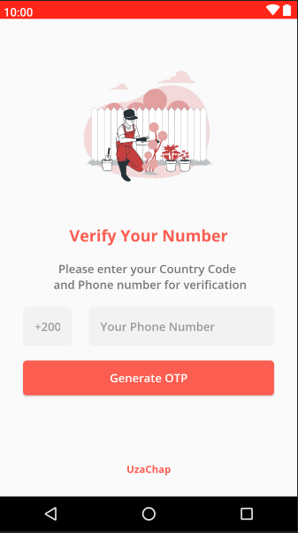
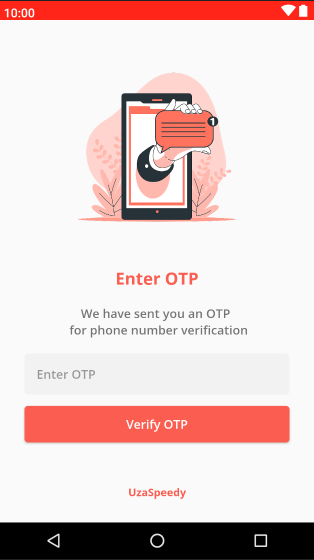

# uzaspeedy
### About
 This project is intended to build a bridge between farmers and retailers in selling their farm product fast and their agreed prices.

### What can you find?
 - A working phone auth.

## ScreenShots
                             

## Disclaimer!!
This project is still under construction mode

## Project setup and Installation
* installations such as JUnit, intellij, SDK, JDK, Android Studio.

1. Clone the repo `https://github.com/Davisdavy/mymovies.git`
2. CD into the folder `cd Organisational_API`

* Run App to compile the program

## Technologies used
* Java.

*Android.

*Firebase.

MIT License

Copyright (c) [2020] [Davis Wafula]

Permission is hereby granted, free of charge, to any person obtaining a copy
of this software and associated documentation files (the "Software"), to deal
in the Software without restriction, including without limitation the rights
to use, copy, modify, merge, publish, distribute, sublicense, and/or sell
copies of the Software, and to permit persons to whom the Software is
furnished to do so, subject to the following conditions:

The above copyright notice and this permission notice shall be included in all
copies or substantial portions of the Software.

THE SOFTWARE IS PROVIDED "AS IS", WITHOUT WARRANTY OF ANY KIND, EXPRESS OR
IMPLIED, INCLUDING BUT NOT LIMITED TO THE WARRANTIES OF MERCHANTABILITY,
FITNESS FOR A PARTICULAR PURPOSE AND NONIN-FRINGEMENT. IN NO EVENT SHALL THE
AUTHORS OR COPYRIGHT HOLDERS BE LIABLE FOR ANY CLAIM, DAMAGES OR OTHER
LIABILITY, WHETHER IN AN ACTION OF CONTRACT, TORT OR OTHERWISE, ARISING FROM,
OUT OF OR IN CONNECTION WITH THE SOFTWARE OR THE USE OR OTHER DEALINGS IN THE
SOFTWARE.
